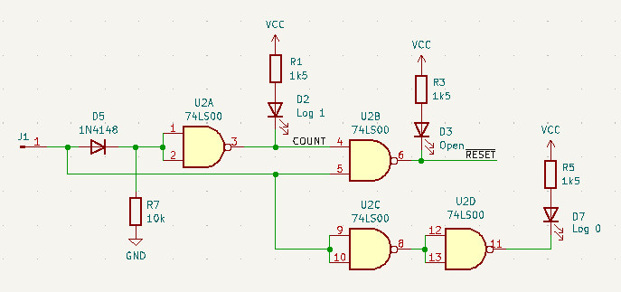

## TTL logic probe with counter

The probe indicates TTL levels "1", "0", "Floating" and contains also counter (74LS93) with LEDs to indicate impulses. 

[Schematics](Documents/TTL-Logic-Probe.pdf)

Interesting part is the detection of "open"/"floating" input. The crcuit is shown in the following picture:

The input of U2A (which forms just a simple inverter) is connected to the ground, which imposes log 0 if the input is floating. In that case there is log 1 on input 4 of U2B and also log 1 on input 5 (input 5 is floating, so it imposes log 1). In this case the output 6 is log 0, so LED D3 is on. For log 0 and log 1 on input, the circuit just follows the logic functions of 74LS00. This means that the circuit behaves predictably based on the input combinations, allowing for reliable operation of the LEDs. Consequently, users can visually monitor the status of the inputs, as the LED indicators provide immediate feedback on the circuit's logic state.

