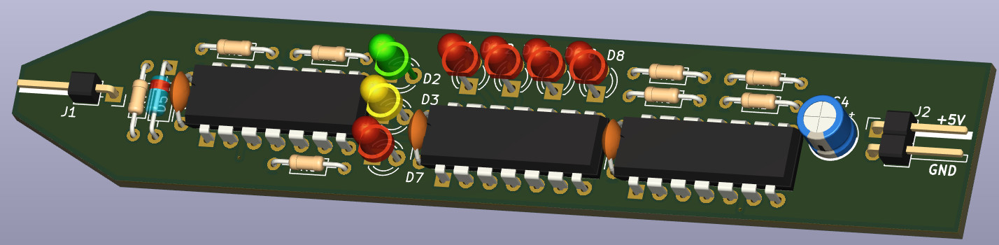

## TTL logic probe with counter

The probe indicates TTL levels "1", "0", "Floating" and contains also counter (74LS93) with LEDs to indicate impulses. 

[Schematics](Documents/TTL-Logic-Probe.pdf)

